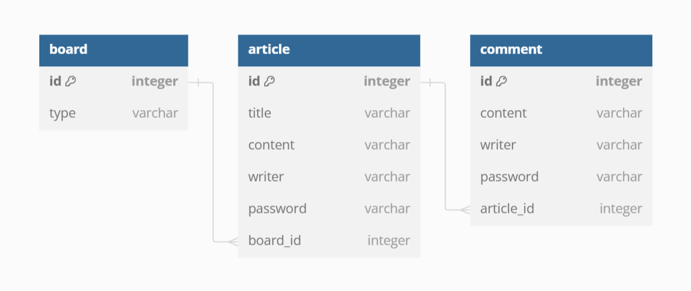

# Ktech-spring-boot-project-2

## 실행

### 준비
1. Set up for running web by [Spring initialzr](https://start.spring.io/) with developer tools: **Spring Web**, **Thymeleaf**, **Lombok** and **Jpa**.
2. After unzip folder, set up for file [build.gradle](build.gradle) with **runtimeOnly** to activate Sqlite. As well, create file [application.yaml](application.yaml) to create sql automatically.
3. Create [ERD](src/main/resources/erd.png) for all tables.
   
4. Create package [model](com.example.project.model) and [repo](com.example.project.repo) to create table and run Jpa.
    - Create 3 Java classes [Board](com/example/project/model/Board.java), [Article](com/example/project/model/Article.java), [Comment](com/example/project/model/Comment.java) 
        1. Base on [ERD](src/main/resources/erd.png) to connect table by *foreign keys* with `@OneToMany` and `@ManyToOne`
        2. Using `@Entity` and `@Getter`, `@Setter` instead of `@Data` to avoid carelessly setting `id` or `password`
    - Create 3 Interfaces [BoardRepo.java](com/example/project/repo/BoardRepo.java), [ArticleRepo.java](com/example/project/repo/ArticleRepo.java), [CommentRepo.java](com/example/project/repo/CommentRepo.java)
        1. Using `@Repository` and `JpaRepository` to create table SQL
    - Create 3 classes Service [BoardService.java](com/example/project/repo/BoardService.java), [ArticleService.java](com/example/project/repo/ArticleService.java) and
      [CommentService.java](com/example/project/repo/CommentService.java) by using `@Service`

5. Creating [data.sql](resources/data.sql) to create data for tables.

### 방식 
#### 1.필수 과제

- 게시판 관련 기능
- 게시글 관련 기능
- 댓글 관련 기능

##### Service

1. [BoardService.java](com/example/project/repo/BoardService.java)
    - Only create method `readAll()` and `readOne()`, data of this table is already created in file [data.sql](resources/data.sql)
    - Create two method `List<Long> articleIds(Long id)` and `int targetIdx(Long id, Long articleId)` for button moving to adjacent article page (**Page before**, **Page after**)
      1. Get all ids of all exist articles into `List<Long>`, so when I select any article page, that page will be called with `articleId` of that article. From `articleId`, I will find index (position) of that `articleId` in the `List<Long>`
      2. That's why I create method `int targetIdx` to find that **index** of opening article page
2. [ArticleService.java](com/example/project/repo/ArticleService.java)
    - Also create method `readAll()` and `readOne()`, also `createArticle()`, `updateArticle()` and `deleteArticle()`
3. [CommentService.java](com/example/project/repo/CommentService.java)
    - Also create method `readAll()` and `readOne()`, also `createComment()` and `deleteComment()`

##### Controller: I just create two `Controller()` as [BoardController](com/example/project/repo/BoardController.java) and [ArticleController](com/example/project/repo/ArticleController.java)

For each `Controller()`, I fix `@RequestMapping()` for link of page.

1. [BoardController](com/example/project/repo/BoardController.java)
    - Creating bean of all 3 services and `Model` to display `.html`
    - `@GetMapping` based on 2 main things: **all board** and **each board**
        1. ***All boards*** type include:
            - **Home page** containing all articles
            
        2. ***One board*** type include: 
            - **Page of each article** contain **all comments** below
            - **Create Article** page is for create new article
            - **Edit Article** is for update and delete article
            - **Create comment** is for create new comment of each article.

            > ***The point*** is each page only including `List<Article>` only one type of board.
    

2. [ArticleController](com/example/project/repo/ArticleController.java)
    - This controller is for all articles of **all boards**
      - **Page of each article** contain **all comments** below
      - **Create Article** page is for create new article
      - **Edit Article** is for update and delete article
      - **Create comment** is for create new comment of each article.
    > It is same to [BoardController](com/example/project/repo/BoardController.java) but this controller is for displaying ***all boards***

#### 2.도전 과제

- 게시글 추가기능
- 헤시태그 기능
- 검색 관련 기능

##### Service

1. [BoardService.java](com/example/project/repo/BoardService.java)
    - Implement `search()` based on **one type** of board
        1. Create method `List<Article> articlesWithKwContent (String keyWord, Long boardId)`
            - This one is searching by **content** in article
            - Get list of articles based on `keyWord`: by using the loop `for` to find content of which article (`article.getContent()`) containing `keyWord`
        2. Create method `List<Article> articlesWithKwTitle (String keyWord, Long boardId)`
            - This one is searching by **title** in article
            - Get list of articles based on `keyWord`: by using the loop `for` to find content of which article (`article.getTitle()`) containing `keyWord`

2. [ArticleService.java](com/example/project/repo/ArticleService.java)
    - Implement `#hashTag` for page
        1. Create method `List<String> listHashTagsByArticle(Long articleId)`
            - This one is to get list of ***all hashtags*** in **one article**
            - Split `String` content of article and find word `.startsWith("#")` and add to `List<String>`
        2. Create method `List<Article> containHashTag(String hashTag)` to find all articles containing target `hashTag`.
    - Implement `search()` based on all boards.
        Similar to [BoardService.java](com/example/project/repo/BoardService.java), but this one is search for all articles of **all boards** 

##### Controller: two `Controller()` as [BoardController](com/example/project/repo/BoardController.java) and [ArticleController](com/example/project/repo/ArticleController.java)

For each `Controller()`, I fix `@RequestMapping()` for link of page.

1. [BoardController](com/example/project/repo/BoardController.java)
    - To implement `@GetMapping` and `@PostMapping` of search tool based on **all types of board** and **one type of board**
    - When input `keyWord` for search, `@PostMapping` page is necessary for `@RequestParam` of `keyWord` and `searchBy` (content, title), when these params return, I will redirect to link containing two params.
   Moreover, `articleService` is also used to implement for `List<Article>` above to display in `.html` by using `if (searchBy.equals("title"))` and `else if (searchBy.equals("content"))`
    - To get result, `@GetMapping("/result/{searchBy}-{keyWord}")` is necessary that getting `@PathVariable` of two params and return `.html` with using `Model` to display result.
    - For **one type of board**, doing similar by using `articleService`
2. [ArticleController](com/example/project/repo/ArticleController.java)
    - In this controller, `@GetMapping("/{id}/{hashTag}")` is created to display page containing all articles with that `hashTag`

## 기술
- Using [Spring initialzr](https://start.spring.io/) to supporting on running web and SQL
- Using [IntelliJ]() app to create project
- Using java 8.0
- Using [Vscode]() to confirm data of db.sqlite.
- Using [Bootstrap](https://getbootstrap.com/) to create `.html` and `.css`
- Using [Font awesome](https://fontawesome.com/) to create icon like `search`
- Using [Canva](https://www.canva.com/) to create video to display in `.html`.

## 고민했던 내용

- **templates** 담은 `resource` 폴더는 아직 조금 까끔하지 않다.
- [data.sql](resources/data.sql) 잘 못 정리한다.
- 각 actions 아직 완벽하게 되지 않는 것 같다.

## 완수한 요구사항

### Self Checklist

#### 필수 과제

- [x] 게시판 관련 기능
- [x] 게시글 관련 기능
- [x] 댓글 관련 기능

#### 도전 과제

- [x] 게시글 추가기능
- [x] 헤시태그 기능
- [x] 검색 관련 기능